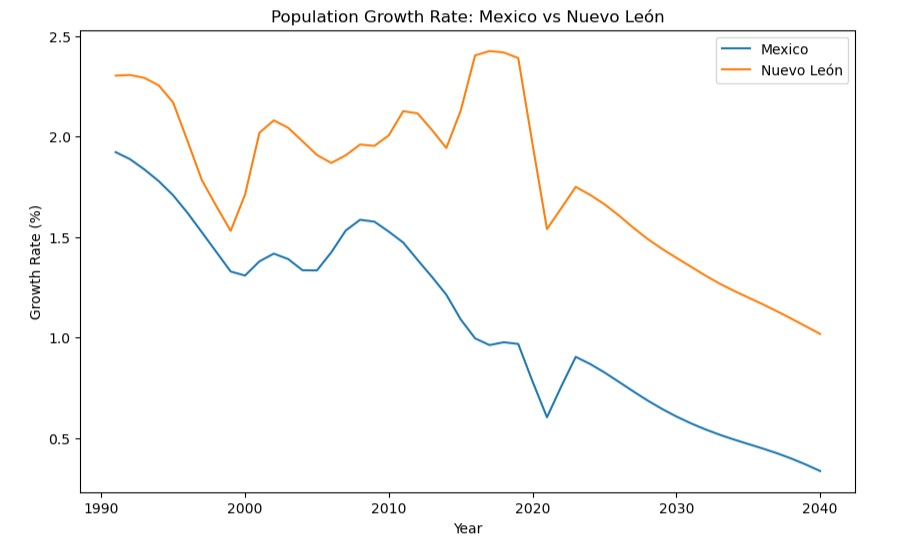
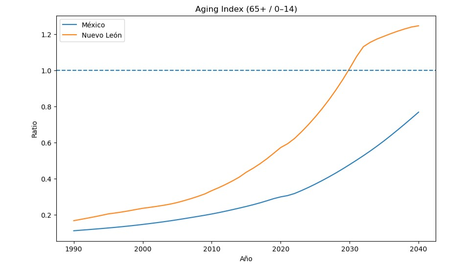
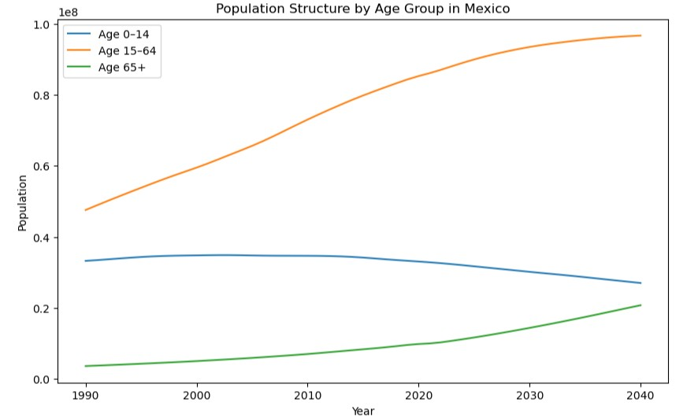
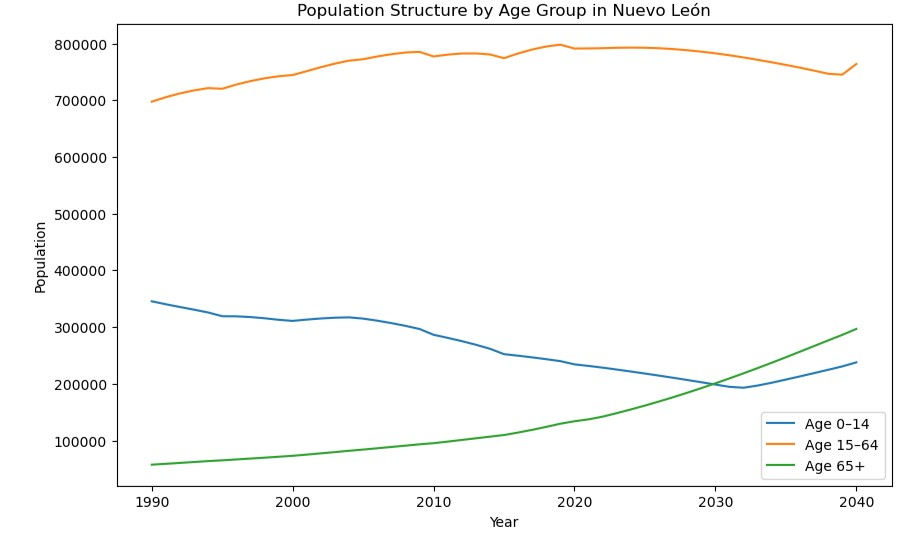

# Demographic-Trends-and-Future-Demand-for-Higher-Education-in-Mexico
Analysis of demographic trends and population aging in Mexico and Nuevo León to assess their impact on future higher education demand.

## Overview
This project analyzes demographic trends in Mexico and the state of Nuevo León to assess their potential impact on the future demand for higher education.

Using population projections by age group, the analysis explores how shifts in population growth and age structure may affect the size of future university-age cohorts.

---

## Business Problem
Higher education institutions depend on a stable or growing population of young people. However, demographic changes such as declining birth rates and population aging may reduce the number of potential students in the future.

This project aims to answer:
How will demographic changes impact the future pool of university-age students?

---

## Data & Methodology
The analysis combines:
- SQL for data extraction and aggregation  
- Python (Pandas, Matplotlib) for data analysis and visualization  

The dataset includes population projections from 1990 to 2040 and is structured into four main datasets:
- Total population of Mexico by year  
- Total population of Nuevo León by year
- Aging index in Mexico
- Population structure by age group in Mexico  
- Population structure by age group in Nuevo León  

---

## Key Insights
- Population growth is slowing down in both Mexico and Nuevo León  
- Nuevo León is aging faster than the national average  
- The young population (0–14) is declining over time  
- The elderly population (65+) is growing rapidly  
- In Nuevo León, older adults are projected to surpass young people earlier than at the national level

---

## 📊 Key Visualizations

These visualizations highlight the main demographic trends impacting higher education demand:

### 📉 Population Growth Rate

### 👵 Aging Index Trend

### 🇲🇽 Population Structure in Mexico

### 📍 Population Structure in Nuevo León

---

## Conclusion
Demographic trends indicate a declining future pool of university-age students, particularly in Nuevo León. This suggests that higher education institutions may need to adapt their strategies, including diversification of programs, targeting non-traditional students, and exploring lifelong learning models.

---

## Tools Used
- Python (Pandas, Matplotlib)  
- SQL  
- Looker Studio / IA Presentation
